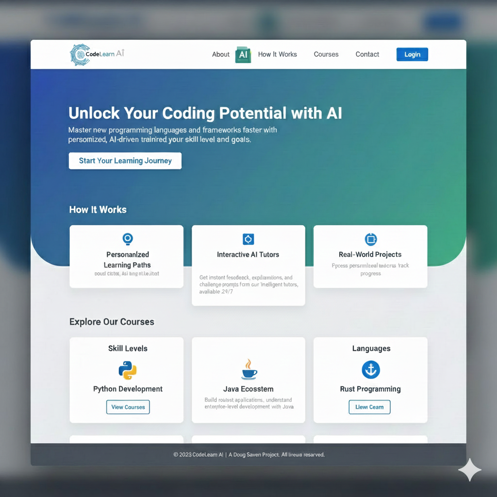
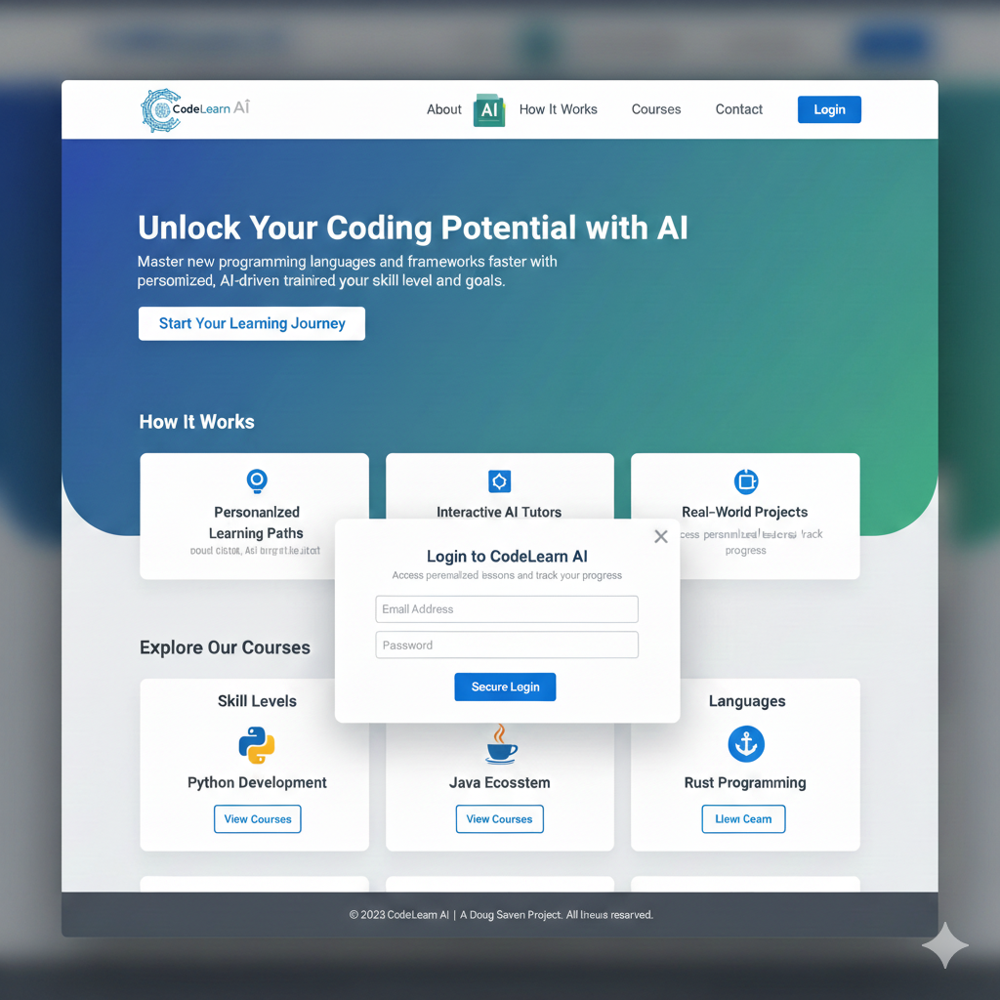

# CodeLearn AI Landing Page - Requirements Document

## 1. Executive Summary

CodeLearn AI requires a public-facing landing page that serves as the primary entry point for prospective users. This page must communicate the platform's value proposition, explain its core functionality, showcase available course offerings, and provide a seamless path to user registration and authentication.

## 2. Business Objectives

### Primary Goals
- **User Acquisition**: Convert visitors into registered users by clearly communicating platform benefits
- **Brand Establishment**: Position CodeLearn AI as a modern, AI-powered educational platform
- **Course Discovery**: Enable prospective users to explore available course offerings without commitment
- **Authentication Gateway**: Provide secure access point for returning users

### Success Metrics
- Conversion rate from visitor to registered user
- Time spent on page before registration/login
- Click-through rate on "Start Your Learning Journey" CTA
- Course catalog engagement (clicks on "View Courses")

## 3. Target Audience

### Primary Users
- **Career Changers**: Individuals transitioning into software development
- **Students**: Computer science students seeking supplemental learning
- **Professional Developers**: Programmers learning additional languages or frameworks
- **Self-Learners**: Anyone interested in coding education with AI assistance

### User Assumptions
- Varying levels of technical expertise (beginner to advanced)
- Mobile and desktop usage expected
- May be comparing multiple learning platforms
- Value personalization and modern learning approaches

## 4. Functional Requirements

### 4.1 Hero Section
**Purpose**: Immediately communicate the platform's unique value proposition

**Must Have**:
- Clear, compelling headline that emphasizes AI-powered personalized learning
- Concise explanation of what the platform offers
- Single, prominent call-to-action for new users to begin
- Visually appealing presentation that conveys innovation and professionalism

**Business Rule**: This is the first impression - must capture attention within 3 seconds

### 4.2 Platform Explanation
**Purpose**: Educate visitors on how the platform differentiates from traditional learning

**Must Have**:
- Three distinct feature highlights that showcase the platform's approach
- Visual representation of each feature for quick comprehension
- Clear, non-technical language accessible to all skill levels

**Required Features to Communicate**:
1. Personalization capability (learning paths adapt to individual users)
2. AI tutoring interaction (real-time, intelligent assistance)
3. Practical application (real projects, not just theory)

### 4.3 Course Catalog Preview
**Purpose**: Demonstrate breadth of offerings and allow course exploration

**Must Have**:
- Display multiple programming languages and skill levels available
- Clear categorization (by skill level and by language)
- Actionable links to explore each course category in detail
- Visual indicators for each language/technology (recognizable logos/icons)

**Required Course Categories**:
- Skill-based tracks (e.g., Python Development)
- Language-specific offerings (e.g., Java, Rust)

**Business Rule**: Must showcase enough variety to appeal to different user types without overwhelming

### 4.4 User Authentication
**Purpose**: Enable secure access for existing users and facilitate new user registration

**Must Have**:
- Persistent access point for login (available from any page location)
- Modal or dedicated interface for credential entry
- Clear distinction between login and new user registration paths
- Security indicators to build user trust (e.g., "Secure Login" messaging)

**Authentication Fields Required**:
- Email address
- Password
- Clear error messaging for failed attempts

**Business Rule**: Authentication must be accessible but not intrusive to the browsing experience

### 4.5 Navigation
**Purpose**: Enable users to explore additional platform information

**Must Have**:
- Consistent navigation available across all pages
- Links to key informational pages:
  - About (company/platform background)
  - How It Works (detailed methodology)
  - Courses (full catalog)
  - Contact (support/inquiries)
- Clear visual indicator of AI integration (platform differentiator)
- Login access point

**Business Rule**: Navigation should be intuitive and follow web conventions

### 4.6 Footer
**Purpose**: Provide legal information and attribution

**Must Have**:
- Copyright notice
- Project attribution
- Consistent placement across all pages

## 5. Non-Functional Requirements

### 5.1 Performance
- Page must load within 3 seconds on standard broadband connections
- Images and assets must be optimized for web delivery
- Smooth scrolling and transitions without lag

### 5.2 Accessibility
- Must comply with WCAG 2.1 Level AA standards
- All interactive elements must be keyboard accessible
- Sufficient color contrast for text readability
- Screen reader compatible
- Alternative text for all visual content

### 5.3 Responsiveness
- Must function properly on desktop computers (various screen sizes)
- Must provide excellent experience on tablets
- Must be fully functional on mobile devices (portrait and landscape)
- No content should be inaccessible on any device type

### 5.4 Browser Compatibility
- Must function on all modern web browsers
- Consistent experience across Chrome, Firefox, Safari, and Edge
- Graceful degradation for older browser versions where applicable

### 5.5 Security
- All authentication must use secure transmission (HTTPS)
- Password fields must mask input
- No sensitive data stored in client-side code
- Protection against common web vulnerabilities (XSS, CSRF)

### 5.6 SEO Requirements
- Proper semantic HTML structure
- Meta tags for search engine indexing
- Descriptive page title and meta description
- Fast load times for improved search rankings

## 6. Content Requirements

### 6.1 Messaging Tone
- Professional yet approachable
- Emphasizes empowerment and capability building
- Avoids overly technical jargon
- Conveys innovation through AI integration

### 6.2 Required Copy Elements
- Platform name and tagline
- Value proposition statement
- Feature descriptions (3 distinct features)
- Course category names and descriptions
- Call-to-action text
- Legal/copyright information

### 6.3 Visual Assets
- Platform logo
- Technology/language logos for supported courses
- Feature icons representing key platform capabilities
- Placeholder or representative imagery that conveys learning and technology

## 7. User Journey Requirements

### 7.1 New Visitor Flow
1. Land on page → see value proposition immediately
2. Scroll to understand "How It Works"
3. Explore course offerings
4. Decide to proceed → click primary CTA or login
5. Enter authentication flow

### 7.2 Returning User Flow
1. Land on page
2. Click login from navigation
3. Enter credentials
4. Access platform dashboard (not part of this page)

### 7.3 Course Explorer Flow
1. View course categories on landing page
2. Click "View Courses" for specific category
3. Either: authenticate first, or browse courses then authenticate

## 8. Business Rules

### Authentication Requirements
- Users must authenticate to access course content
- Course catalog preview is available without authentication
- Login modal should appear when users attempt to access restricted content

### Content Display
- All course categories must be equally prominent
- Feature highlights must emphasize AI-powered personalization as core differentiator
- Doug Saven project attribution required in footer

### User Experience
- No forced registration to browse public information
- Clear path to get started without confusion
- Minimal friction between interest and taking action

## 9. Constraints and Assumptions

### Technical Constraints
- Must integrate with existing authentication system
- Must link to existing course catalog pages
- Must support future expansion of course offerings

### Design Constraints
- Must align with "CodeLearn AI" brand identity
- Must convey professionalism and modern technology
- Must differentiate from generic educational platforms

### Assumptions
- Users have basic web browsing skills
- Users understand what "AI-powered" learning implies
- Course catalog exists and is accessible via routing
- Authentication backend is operational

## 10. Out of Scope

The following are explicitly NOT part of this landing page requirement:
- Course content delivery interface
- User dashboard/profile management
- Payment processing
- Course creation or management tools
- User progress tracking interface
- Social features (forums, user connections)
- Password recovery flow (may trigger modal/redirect but full flow is separate)
- User registration form (separate from login)

## 11. Future Considerations

### Potential Enhancements
- Video demonstration of platform capabilities
- User testimonials or success stories
- Integration with social proof (number of users, courses completed)
- A/B testing capability for different value propositions
- Multi-language support
- Live chat support widget

### Analytics Requirements
- Track which course categories receive most interest
- Monitor CTA click-through rates
- Measure scroll depth and engagement
- Track authentication modal abandonment rates

## 12. Acceptance Criteria

The landing page will be considered complete when:
- All functional requirements are implemented and verified
- Page loads and functions correctly on all required devices and browsers
- Authentication flow successfully connects to backend
- All course categories are displayed and linkable
- Accessibility audit passes WCAG 2.1 Level AA
- Performance benchmarks are met (3-second load time)
- Content is reviewed and approved for accuracy and tone
- Security review confirms no vulnerabilities

## 13. Mockup

---

**Document Owner**: Doug Saven  
**Project**: CodeLearn AI Platform  
**Document Type**: Functional Requirements  
**Status**: Draft for Review